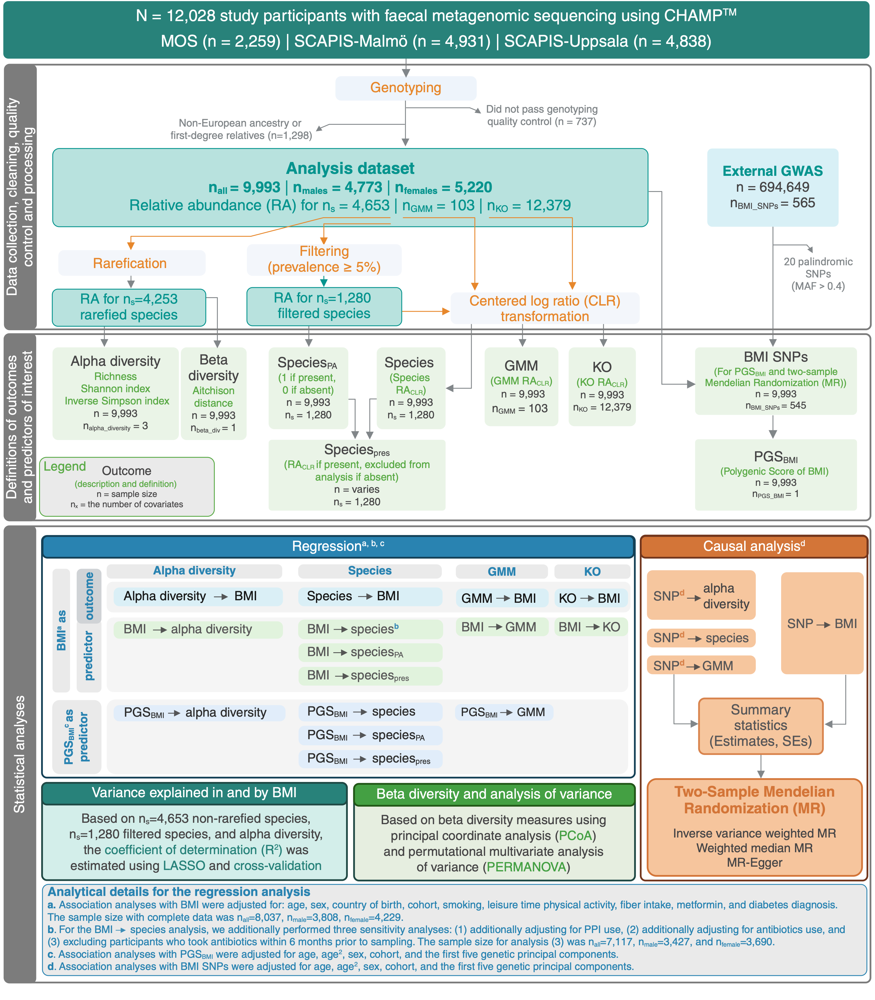

# Body mass index as a determinant of gut microbiome composition and function: results of a comprehensive analysis of a large population 

# Study overview
In this project, we studied the connection between BMI and gut metagenome in 3 large Swedish population cohorts (n = 9,993): The Swedish CArdioPulmonary bioImage 
Study (SCAPIS Malmö and SCAPIS Uppsala) and Malmö Offspring Study (MOS).

## 1. Study abstract:
Using a comprehensive analytical approach designed to tackle challenges in microbiome data, this study investigated the nature, robustness and causality of relationships between BMI and the gut microbiome among 9,993 participants from three Swedish cohorts.  Metagenomic species (n=1,280; ≥5% prevalence) were modelled as species relative abundance (RA), presence-absence (skipping compositionality) and present species RA (skipping zero-inflation). Overall, 1,228 unique BMI-species associations were detected of which 276 species showed directionally consistent associations through all models.  In conformity to decreased alpha-diversity, 58.8% of all species were more frequently absent among those with higher BMI, while 38.8% of present species showed positive association with BMI. Two-sample Mendelian Randomization (MR) revealed decreased microbial alpha-diversity by higher BMI and deviations in RA of 94 species and eight microbial pathways. Specifically, overrepresentation of oral species in higher RA and decreased butyrate production and mucin degradation, and increased propionate production by higher BMI were demonstrated by MR analyses. Finally, consistently stronger observational- and MR-associations were observed in females compared to males. In summary, our study demonstrates an ecosystem-wide decrease in species prevalence by higher BMI, identifies a superset of species with directionally consistent BMI-associations, and presents novel evidence for BMI as a determinant of gut microbiome diversity, composition and function. More studies are needed to explore sex-specific differences and the bidirectional obesity-microbiome connections in the oral-gut-brain axis.

#### Project workflow: 

## 2. Installations
R v4.4.2.  
Main packages and libraries:  
- vegan
- glmnet
- caret
- BiocParallel
- tidyverse
- rio
- ggplot2
- pheatmap
- ComplexHeatmap
- MendelianRandomization

Others:  
- Cytoscape software (v3.9.1)
- PLINK(v2.0)

## 3. Contact
For any questions or inquiries, please contact Mariam Miari at mariam.miari@med.lu.se.
