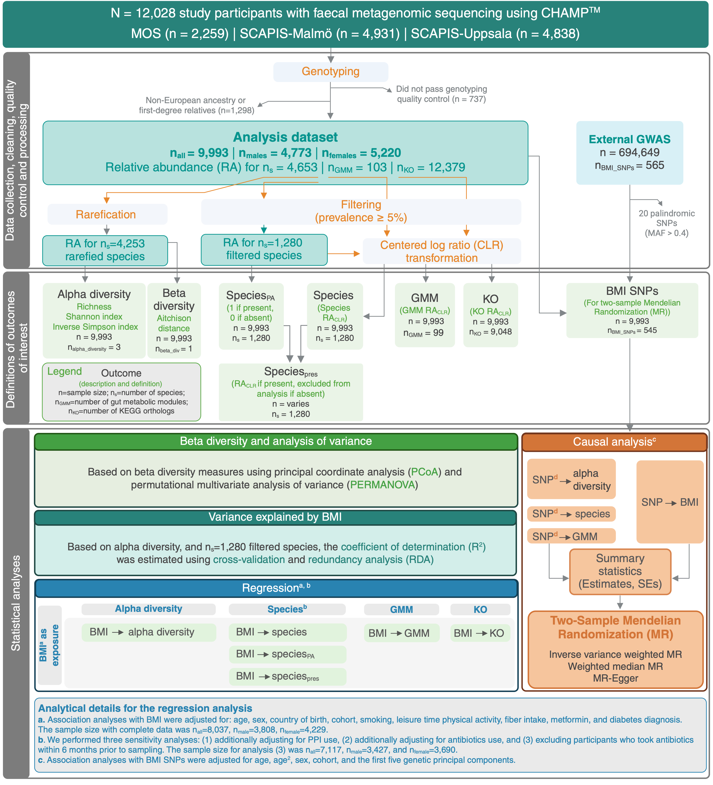

# Body mass index as a determinant of gut microbiome composition and function

# Study overview
In this project, we studied the connection between BMI and gut metagenome in 3 large Swedish population cohorts (n = 9,993): The Swedish CArdioPulmonary bioImage 
Study (SCAPIS Malmö and SCAPIS Uppsala) and Malmö Offspring Study (MOS).

## 1. Study abstract:
Background: Higher body mass index (BMI) has been linked to changes in gut microbiome, but this link remains tenuous and lacks robustness. Therefore, we investigated the relationship between BMI and gut microbiome using a comprehensive analytical approach to examine observed and causal associations.

Methods: We analyzed 9,993 individuals from three Swedish population-based cohorts whose faecal samples underwent identical shotgun metagenomic sequencing and analysis. Our analytical approach (1) addressed challenges in microbiome data analysis, (2) modeled species data using three complementary observational analyses, and (3) assessed potential effects of higher BMI on gut microbiome using two-sample Mendelian randomization (MR).

Results: Among 1,280 microbial species, we found 70 species as directionally consistently associated with BMI in both observational and MR analyses, including 19 species as more likely to be present in the gut when present in oral microbiome. Both approaches provided evidence that higher BMI is associated with lower alpha diversity and with functional shifts, including decreased butyrate production and mucin degradation, and increased propionate production.

Conclusions: The observation that higher BMI is associated with a broad reduction in species prevalence, together with MR evidence suggesting that a subset of these associations may be causal, support the view that BMI may be one of the determinants of several measures of gut microbial diversity, composition, and function. Further research into mechanistic roles and function of the 70 species we identified is needed to better understand the relationship between obesity and the gut microbiome, and whether this knowledge could then be used to target obesity.

#### Project workflow: 

## 2. Installations
R v4.4.2.  
Main packages and libraries:  
- vegan
- glmnet
- caret
- BiocParallel
- tidyverse
- rio
- ggplot2
- pheatmap
- ComplexHeatmap
- MendelianRandomization

Others:  
- Cytoscape software (v3.9.1)
- PLINK(v2.0)

## 3. Contact
For any questions or inquiries, please contact Mariam Miari at mariam.miari@med.lu.se.
